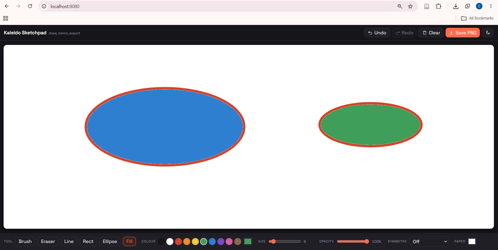
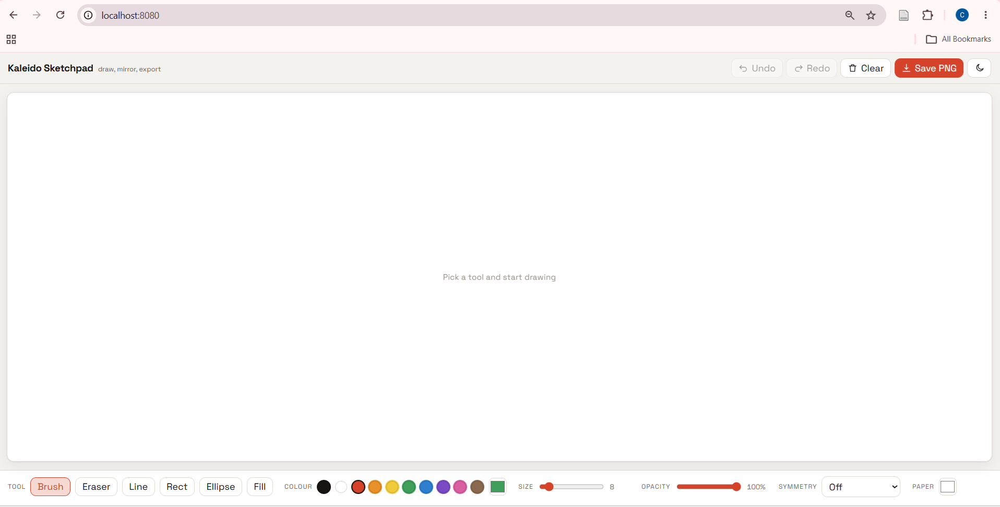

# Kaleido Sketchpad

A front-end drawing app built with plain HTML, CSS and JavaScript — no framework, no build step, no backend. Everything runs in the browser; the only thing kept between visits is your theme preference, stored in `localStorage`.

**Live demo:** _(paste your deployed URL here)_

## Files

| File | Purpose |
| --- | --- |
| `index.html` | Page structure and toolbar markup |
| `styles.css` | Layout, theming (light/dark), responsive rules |
| `app.js` | Canvas drawing engine, tools, symmetry, undo/redo, PNG export |
| `vercel.json` | Static hosting config for Vercel deploys |

## Features

- **Six tools** — brush, eraser, line, rectangle, ellipse, flood fill
- **Symmetry modes** — horizontal mirror, vertical mirror, quad, and 6- or 12-fold mandala
- **Colour** — 10-swatch palette plus a custom colour picker
- **Size and opacity sliders** for every tool
- **Changeable paper colour** — the drawing layer stays transparent internally and is only flattened onto the paper colour on export, so changing paper never disturbs existing artwork
- **Undo / redo**, 30 steps deep
- **Light and dark theme**, remembered between visits
- **PNG export** via a standard browser download (works on any static host)
- **Pointer-event input** — mouse, trackpad, touch and stylus all work, with coalesced events for smooth strokes
- **Responsive** — a `ResizeObserver` rescales the canvas without losing the drawing

## Keyboard shortcuts

| Key | Action |
| --- | --- |
| `B` | Brush |
| `E` | Eraser |
| `L` | Line |
| `R` | Rectangle |
| `O` | Ellipse |
| `F` | Fill |
| `Ctrl/Cmd + Z` | Undo |
| `Ctrl/Cmd + Shift + Z` | Redo |

## How it works

Two stacked `<canvas>` elements sit inside `#stage`. The lower canvas (`#base`) holds the committed artwork; the upper one (`#preview`) is a scratch layer that previews shapes while dragging, so a rectangle can follow the cursor without repeatedly repainting the real drawing.

Symmetry is a coordinate transform in `mirrored()`: each pointer position expands into a set of mirrored or rotated points, and the same stroke segment is drawn once per point. The eraser uses the `destination-out` composite operation rather than painting the paper colour directly, which is what lets the paper colour change at any time without affecting existing strokes.

Flood fill reads the canvas `ImageData` and runs a stack-based scanfill with a small colour tolerance, so anti-aliased edges don't leave a visible halo.

## Run locally

```bash
python3 -m http.server 8080
# then visit http://localhost:8080
```

Or just open `index.html` directly in a browser — there's no build step.

## Deploy

**Vercel** (uses `vercel.json`):
```bash
npm i -g vercel
vercel
```

**GitHub Pages:** Settings → Pages → Source: Deploy from a branch → `main` / `(root)`.

## Screenshots



